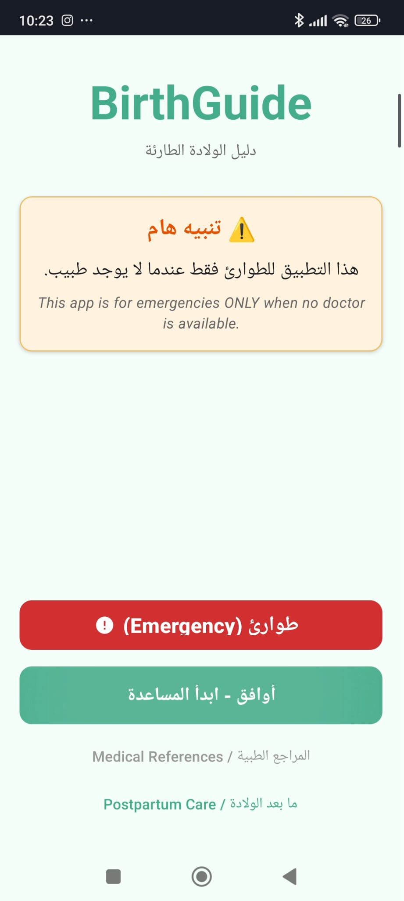
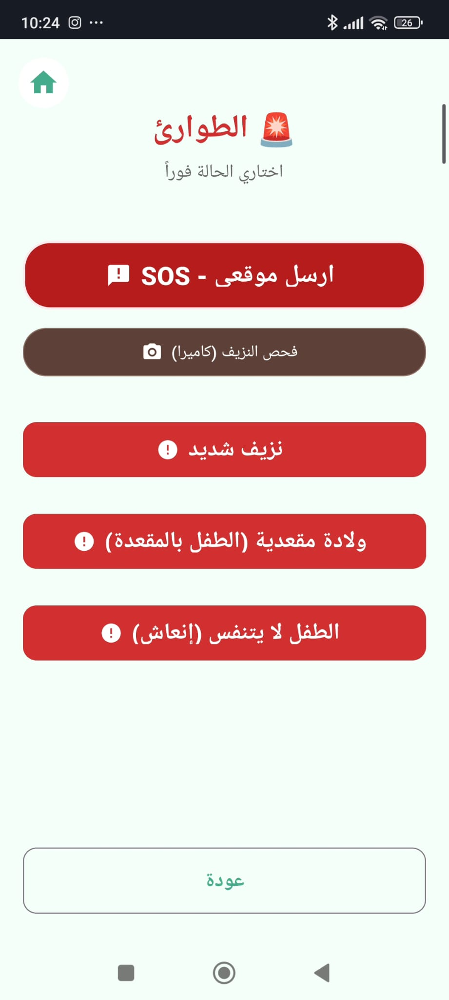

# BirthGuide: Emergency Childbirth Assistant

**BirthGuide** is a bilingual (Arabic/English) mobile application designed to guide women through emergency childbirth situations when professional medical help is unavailable. Built with React Native and Expo, it provides step-by-step voice-guided protocols based on WHO emergency obstetric care guidelines, enabling hands-free navigation during high-pressure labor situations.

**MEDICAL DISCLAIMER**: This application is designed for **emergency situations ONLY** when professional medical help is unavailable. It is based on WHO emergency obstetric care protocols but **should never replace professional medical assistance** when available. This is a first-response solution to provide guidance in crisis situations, not a substitute for trained medical professionals.

---

 

## Quick Guide to Get the App Running

### Prerequisites
- **Node.js** (v16 or higher) - [Download here](https://nodejs.org/)
- **npm** (comes with Node.js)
- **Expo Go app** on your mobile device:
  - [iOS App Store](https://apps.apple.com/app/expo-go/id982107779)
  - [Google Play Store](https://play.google.com/store/apps/details?id=host.exp.exponent)

### Steps to Deploying the App

#### Step 1: Clone the Repository

Open your terminal and run the following scripts as per instructions.

```bash
git clone https://github.com/ruusbrews/tiryaq-birthguide.git
cd tiryaq-birthguide
```

#### Step 2: Install Dependencies
```bash
npm install
```

This will install all required packages including:
- React Native and Expo SDK
- Navigation (`expo-router`)
- UI components (`react-native-paper`)
- Voice services (`expo-speech`, `expo-av`)
- Camera and SMS functionality
- And other dependencies listed in `package.json`

#### Step 3: Configure the Fanar API Key (The app will still deploy without this step but it is required if the intention is to test the Speech-to-Text functionality)

1. **Add your Fanar API key** to the `VoiceInputService.ts` file:
```
FANAR_API_KEY=your-api-key-here
```

> **Note:** If you don't have a Fanar API key, you can get one from [Fanar API](https://api.fanar.qa). The app will still work without voice input if the API key is missing or credits are exhausted - users can simply tap buttons instead.

3. **Verify `.env` is in `.gitignore`** (it should already be there):
```bash
# Check if .env is listed in .gitignore
cat .gitignore | grep .env
```

#### Step 4: Start the Development Server
```bash
npx expo start
```

You should see a QR code in your terminal.

#### Step 5: Run on Your Device

**On Mobile Device:**
1. **Android**: Use the Expo Go app and scan the QR code from the terminal.
   **iOS**: Use the Camera app to scan the QR code on your terminal.
2. The app will load on your device

**On Emulator/Simulator:**
```bash
# For iOS simulator (Mac only)
npx expo start --ios

# For Android emulator
npx expo start --android
```

---

## Testing the Application

### Basic Functionality Test
1. **Welcome Screen**: App should greet you in Arabic with voice
2. **Start Assessment**: Click "أوافق - ابدأ المساعدة"
3. **Answer Questions**: Either speak in Arabic OR tap the buttons
4. **View Guide**: See labor stage instructions
5. **Emergency Access**: Click "طوارئ" to access emergency protocols

### Voice Input Test (If API Key is Active)
1. Wait for the microphone indicator (💡 يمكنك التحدث)
2. Speak Arabic responses like "نعم", "لا", "تم"
3. The app should automatically advance

### Manual Input Test (Always Works)
1. Simply tap any button option
2. No voice needed - fully functional with touch only

---

## License

This project is licensed under the MIT License - see the [LICENSE](LICENSE) file for details.

---

## Some Troubleshooting Guidelines (if needed)

### Issue: Voice Recognition Shows "Rate Limit Reached" or API Error

**Cause:** Fanar STT API credits have been exhausted.

**Solution:**
1. Get a new API key from [Fanar API](https://api.fanar.qa)
2. Update `FANAR_API_KEY` in your `.env` file
3. Restart the app: `npx expo start --clear`

**Workaround (No Action Needed):**
-  The app is **fully functional** without voice input
-  All features work by **tapping on-screen buttons**
-  Voice output (text-to-speech) continues to work normally
-  Emergency protocols are accessible and functional

### Issue: "expo-constants" or Module Not Found Errors

**Solution:**
```bash
npx expo install expo-constants
npx expo start --clear
```

### Issue: QR Code Not Scanning

**Solution:**
- Make sure your phone and computer are on the **same WiFi network**
- Try using the **tunnel** connection:
  ```bash
  npx expo start --tunnel
  ```

### Issue: App Crashes on Startup

**Solution:**
```bash
# Clear cache and restart
npx expo start --clear

# If that doesn't work, reinstall dependencies
rm -rf node_modules
npm install
npx expo start --clear
```

### Issue: Camera/SMS Not Working

**Cause:** Permissions not granted or running on emulator.

**Solution:**
- When prompted, **allow** camera and location permissions
- SMS features require a physical device (won't work on emulators)

---

## Core Architecture

### Frontend & UI
- **Framework**: React Native with **Expo Go**.
- **Navigation**: `expo-router` for file-based routing.
- **Theming**: `react-native-paper` using a "Hospital Green" (#94E394) theme.
- **UI Components**: 
  - `ScreenContainer`: Global layout with a reactive `ListeningIndicator`.
  - `VoiceButton`: Standard button that triggers TTS feedback.
  - `DangerButton`: High-visibility red button for critical actions.

### Services (Logic Layer)
- **VoiceService (`expo-speech`)**: Handles Text-to-Speech (TTS) in Arabic. 
  - Optimized for speed (0.8) for clarity.
  - **Mute Toggle**: A dedicated button mutes audio output ONLY.
- **HealthRecordSMSService (`expo-sms`)**: Compacts and sends prenatal health data.
  - **SMS Specification**: Uses a pipe-delimited format to stay within character limits: `BIRTHGUIDE|AGE:3|GOV:2|DISP:Y|PREG:Y|MO:7|ANC:Y|...`
- **VoiceInputService (`expo-av` + Fanar API)**: Powers hands-free interaction.
  - **Scoped Activity**: STT is active **only** on Assessment questions, Guide instructions, and Emergency Protocols. Other areas (Home, Health Tracking) are touch-only.
  - **Persistent Mode**: On active screens, STT remains ready continuously. It automatically restarts its listening window if no command is recognized.
  - **Independent of Mute**: Hands-free input works even when terminal audio output (TTS) is muted via the toggle.

### Data Layer
- **`HealthRecordStorage.ts`**: Offline-first storage using `AsyncStorage` to persist prenatal records.
- **`HealthRecordSMSService.ts`**: Logic to compress records into a pipe-delimited SMS format for low-bandwidth submission.
- **`decisions.ts`**: Logic tree for emergency evaluation.

---

## Prenatal Health Tracking System
The app features an offline-first monitoring system for pregnant women. Data is collected across seven structured sections and submitted via a consolidated SMS:
- **Section A**: Identification (Age, Location, Displacement status)
- **Section B**: Pregnancy Status (Months, Medical history, Risk factors)
- **Section C**: Antenatal Care (Facility visits and diagnostic results)
- **Section D**: Living Conditions (Accessibility to food and clean water)
- **Section E**: Mental Health (Depression and wellbeing screening)
- **Section F & G**: Consent and Data Participation options

**SMS Data Format**: `BIRTHGUIDE|AGE:3|GOV:2|DISP:Y|PREG:Y|MO:7|ANC:Y|...`

---

## Key Interaction Flow
1. **Instruction**: `VoiceService` reads steps or questions (unless muted).
2. **Targeted Listening**: On question/protocol screens, `ListeningIndicator` appears and STT starts. 
3. **Continuous Capture**: If no command is matched, the app immediately restarts the 5-second listening window.
4. **Simultaneous Input**: Both voice and touch are valid at any time. Tapping a button cancel's the current voice capture to prioritize manual intent.

---

## Features
- **Hands-free Persistent STT**: Continuous voice monitoring.
- **Mute-safe Accessibility**: Decoupled audio input/output.
- **Offline Health Monitoring**: Track prenatal health without internet.
- **SMS Data Submission**: Send critical health metrics via standard SMS.
- **WHO Guidelines**: Medical protocols based on international standards.
- **Bilingual Interface**: Arabic (primary) and English
- **Touch-Based Fallback**: Full functionality with button taps only
- **Emergency Protocols**: Step-by-step guides with visual aids
  - Postpartum Hemorrhage (PPH)
  - Breech Birth
  - Newborn Resuscitation
- **Labor Assessment**: QnA evaluation to determine stage
- **Offline-First Model**: Core functionalities other than STT working.
- **Stage-Specific Guidance**: Instructions for early, active, and pushing stages
- **SOS Location Sharing**: Send GPS location via SMS in emergencies
- **WHO-Based**: All protocols based on World Health Organization guidelines
- **Postpartum Care**: First-hour checklist for mother and baby

---

## Legal Compliance & Privacy

### Informed Consent
BirthGuide prioritizes user autonomy and data transparency:
- **Explicit Consent**: No health data or emergency alerts are sent without explicit user agreement via a consent popup.
- **Data Minimization**: Shared health records do not include full names, exact addresses, or GPS coordinates. They focus on clinical metrics for resource planning.
- **SOS Transparency**: Emergency alerts clearly state that delivery is not guaranteed and that the message is not encrypted.

### Guidance Limitations
- **First-Response Only**: The app is a first-response tool for crisis settings and does not replace professional medical personnel.
- **Network Dependency**: Users are informed that app functions like SMS delivery and SOS alerts are dependent on active mobile network availability.
- **Voluntary Participation**: All data sharing for health planning is voluntary; emergency birth guidance remains fully accessible regardless of data sharing choices.

---

## Credits & Acknowledgments

### Medical Protocols
- **World Health Organization (WHO)**: Emergency Obstetric Care protocols
- **UNFPA**: Emergency obstetric care guidelines and basic emergency kits
- **WHO IMPAC**: Integrated Management of Pregnancy and Childbirth

### Technology & Services
- **Fanar AI**: Arabic Speech-to-Text API for hands-free interaction
- **Expo**: React Native development platform
- **React Native Paper**: Material Design UI components

---

## Important Notes for Evaluators

1. **Voice input is optional**: If the Fanar API key has exhausted its credits, the app remains fully functional using button taps. This is by design.

2. **Permissions required**: For full functionality, grant camera and location permissions when prompted. SMS features require a physical device.

3. **Arabic Language**: The primary interface and voice interactions are in Arabic.

4. **Emergency Use Only**: This application is designed for genuine emergency situations where professional medical care is not accessible.


---

**Built with love for mothers (and people) in crisis situations worldwide.🤍**